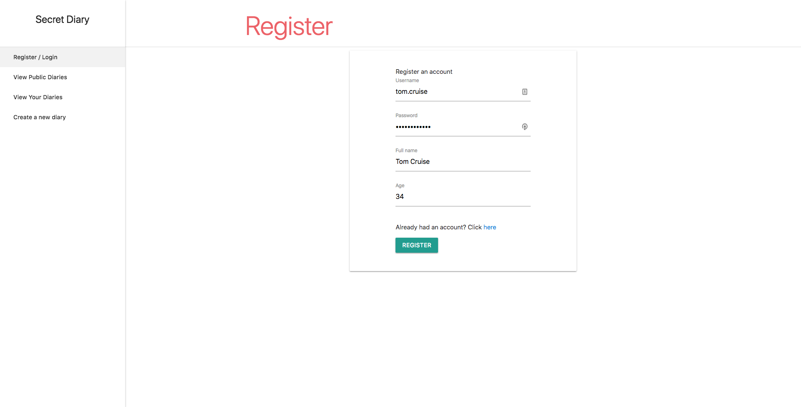
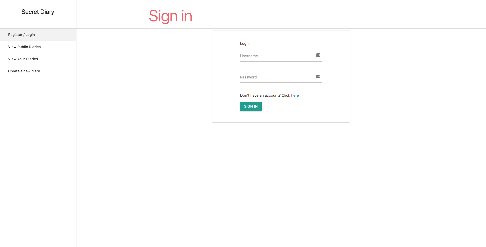
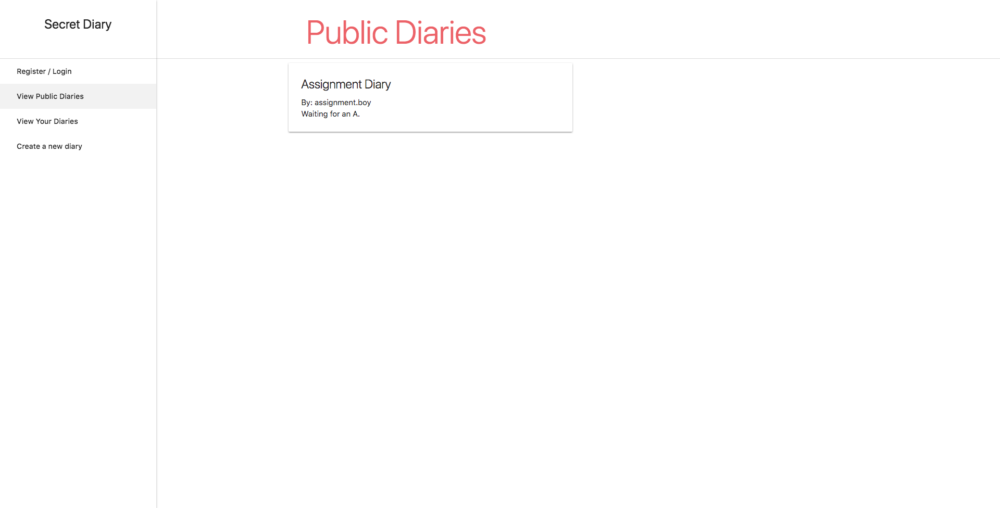
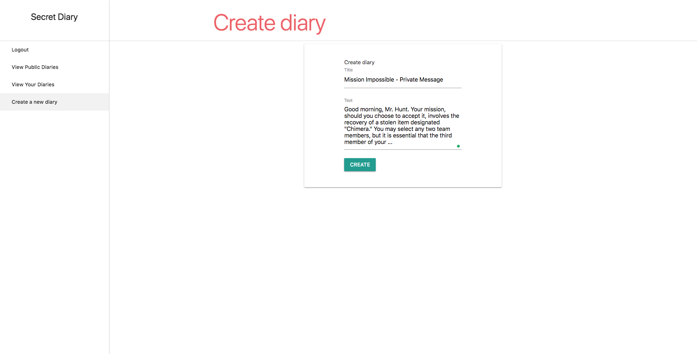

# rest-api-development

CS5331 Assignment 1 Project Reference Repository

## Instructions

Your objective is to implement a web application that provides the endpoints
specified here: https://cs5331-assignments.github.io/rest-api-development/.

The project has been packaged in an easy to set-up docker container with the
skeleton code implemented in Python Flask. You are not restricted in terms of
which language, web stack, or database you desire to use. However, please note
that very limited support can be given to those who decide to veer off the
beaten path.

You may be required to modify the following files/directories:

- Dockerfile - contains the environment setup scripts to ensure a homogenous
  development environment
- src/ - contains the front-end code in `html` and the skeleton Flask API code
  in `service`
- img/ - contains images used for this README

Assuming you're developing on an Ubuntu 16.04 machine, the quick instructions
to get up and running are:

```
# Install Docker

sudo apt-get update
sudo apt-get install \
    apt-transport-https \
    ca-certificates \
    curl \
    software-properties-common
curl -fsSL https://download.docker.com/linux/ubuntu/gpg | sudo apt-key add -
sudo add-apt-repository \
   "deb [arch=amd64] https://download.docker.com/linux/ubuntu \
   $(lsb_release -cs) \
   stable"
sudo apt-get update
sudo apt-get install docker-ce

# Verify Docker Works

sudo docker run hello-world

# Run the skeleton implementation

sudo ./run.sh
```

(Docker CE installation instructions are from this
[link](https://docs.docker.com/install/linux/docker-ce/ubuntu/#install-using-the-repository).)

**Please consult your assignment hand-out for detailed setup information.**

## Grading

The implementation will be graded in an automated fashion on an Ubuntu 16.04
virtual machine by building the docker container found in your repository and
running it. The grading script will interact with your API.

The following ports are expected to be accessible:

1. 80, on which static HTML content, including the front-end, is served.
2. 8080, on which the API is exposed.

To verify this, please run the following commands:

```
sudo ./run.sh
```

On a different window:

```
curl http://localhost:80
curl http://localhost:8080
```

If a response is received, you're good to go.

**Please replace the details below with information relevant to your team.**

## Screenshots

Please replace the example screenshots with screenshots of your completed
project. Feel free to include more than one.








## Administration and Evaluation

Please fill out this section with details relevant to your team.

### Team Members

1. Chua Si Hao
2. Low Wei Kit
3. Hoo De Lin
4. Ye Kyaw Swa Aung

### Short Answer Questions

#### Question 1: Briefly describe the web technology stack used in your implementation.

Answer:
We have implemented the assignment with the following web technology stack:
1. Django (Backend API Requirements)
2. MySQLite - (Database Storage)
3. HTML/CSS/Javascript with MaterializeCSS and jQuery (Frontend + Ajax calls)
4. Ubuntu/Linux (Docker image)

#### Question 2: Are there any security considerations your team thought about?

Answer:
1. We have found out that our web app is susceptible to XSS attack. Putting a `<script>` tag on any input field (“User registration”, “Diary creation”) will cause the script to be executed. To fix this issue, we change `<` to `&lt;` and `>` to `&gt;`
2. Similarly, the backend API
3. The backend API has debug mode on by default which grant additional privileges and specific error messages from showing. This could be potential security risk if not disabled and secured at production. We enforced the settings and allowed localhost to make API calls.

#### Question 3: Are there any improvements you would make to the API specification to improve the security of the web application?

Answer:
1. Restrict HTTP methods
Apply a whitelist of permitted HTTP Methods e.g. GET, POST, PUT;
Reject all requests not matching the whitelist with HTTP response code 405 Method not allowed
Make sure the caller is authorised to use the incoming HTTP method on the resource collection, action, and record

2. Encrypt private diaries in the database

3. HTTP unencrypted traffic
We are not using HTTPS when submit requests. This implies that the calls (especially user-sensitive data) are not safe from illegal tampering

4. Validate content types
A REST request or response body should match the intended content type in the header. Otherwise it may lead to misinterpretation at the back-end side and lead to code injection/execution.

5. Respond with generic error messages - avoid revealing details of the failure unnecessarily
For instance, Invalid Auth Token may give users a hint to why their requests failed.


#### Question 4: Are there any additional features you would like to highlight?

Answer:
Client-side redirection: The client will always check if a token is available before the user is able to gain access to privileged pages (Viewing private diaries, Creating new diaries)

#### Question 5: Is your web application vulnerable? If yes, how and why? If not, what measures did you take to secure it?

Answer:
Initially, we have found out that our web app is susceptible to XSS attack. Putting a `<script>` tag on any input field (“User registration”, “Diary creation”) will cause the script to be executed. To fix this issue, we change `<` to `&lt;` and `>` to `&gt;`

#### Feedback: Is there any other feedback you would like to give?

Answer: None

### Declaration

#### Please declare your individual contributions to the assignment:

1. Chua Si Hao
    - Integrated feature x into component y
    - Implemented z
2. Low Wei Kit
    - Designed the database schema
3. Hoo De Lin
    - Wrote the front-end code
4. Member 4 Name
    - Integrated the API calls, handle request and response at the Front-end.

